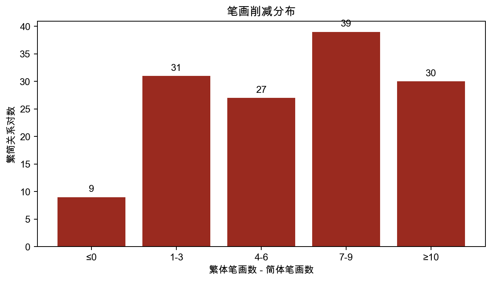
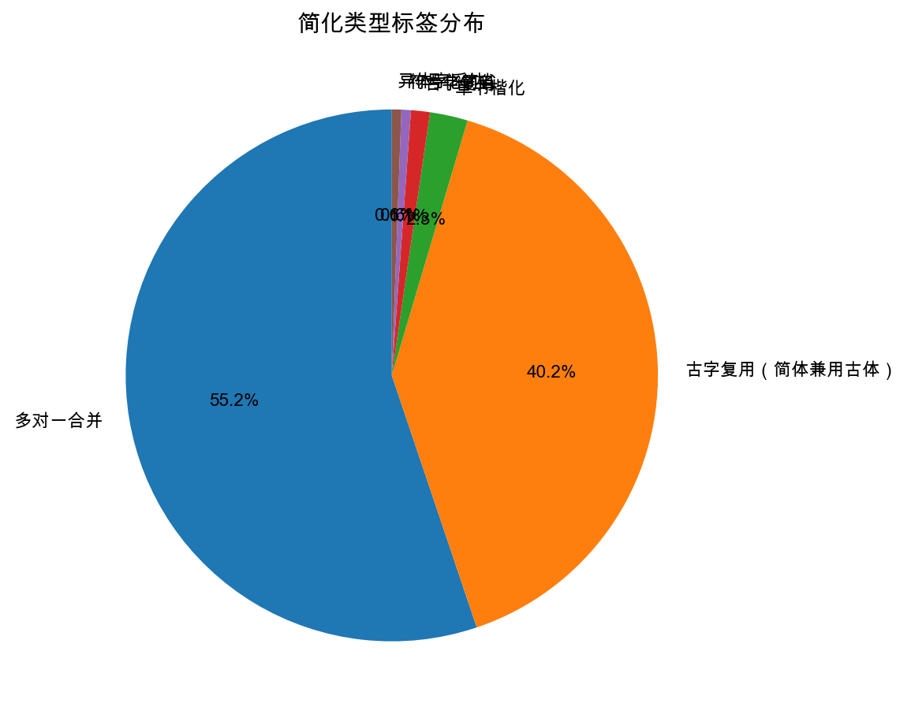
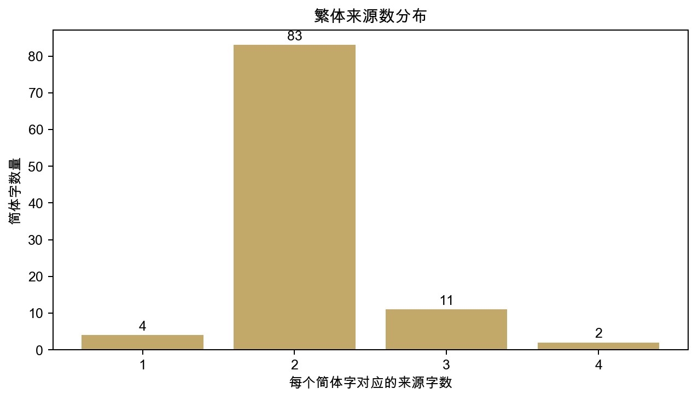
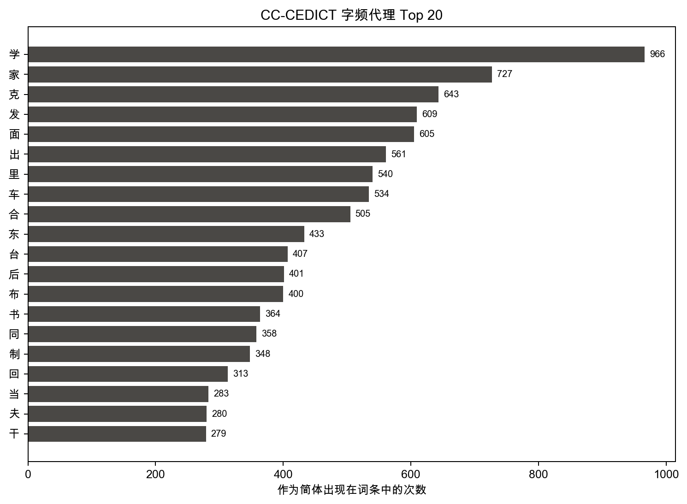

# 计算语言学分析报告：Relumine 汉字数据库 v1

> 本报告从 Relumine 自建汉字数据库 v1（100 字）出发，融合 Unihan、OpenCC、CC-CEDICT、CHISE IDS 四个外部数据库，从七个维度做定量分析，展示「博采众长」形成的可计算汉字知识库的特征与价值。

---

## 可视化图表

下面四张图对应本文的核心计算语言学指标，便于在汇报中直接展示。

---

## 一、简化类型分布

汉字简化并非一种操作，而是多种历史机制的叠加。我们对 100 字的简化类型做精化标注（auto_external 字区分「古字复用」与「纯合并」）：

| 简化类型 | 字数 | 占比 |
| --- | --- | --- |
| 多对一合并 | 96 | 96% |
| 古字复用（简体兼用古体） | 70 | 70% |
| 草书楷化 | 4 | 4% |
| 古字复用 | 2 | 2% |
| 符号化简省 | 1 | 1% |
| 异体字采纳 | 1 | 1% |

人工精修的 10 个字简化类型（最具典型性）：

- **学**：草书楷化
- **书**：草书楷化
- **东**：草书楷化、符号化简省
- **车**：草书楷化
- **发**：多对一合并
- **后**：多对一合并、古字复用
- **面**：多对一合并
- **台**：多对一合并、古字复用
- **余**：多对一合并
- **杰**：多对一合并、异体字采纳

其中「简体兼用古体」型（如 `系→系/係/繫`）共 **70** 字，典型例：蒙、干、系、胡、向、只、泛、熏……。这类字的简体形式本身就是某个传统字体，故不能视为「创造新字形」，而应归入古字复用。

## 二、笔画削减量化分析

共分析 **136** 对繁→简字形，统计笔画削减量（繁体笔画 − 简体笔画）：

- 平均削减：**6.54 笔**
- 中位数：**7 笔**
- 削减最多：`韆→千`（24 笔→3 笔，减 **21 笔**，削减率 87.5%）

| 笔画削减区间 | 对数 | 说明 |
| --- | --- | --- |
| ≤ 0（无削减） | 9 | 简繁笔画相同或简体更复杂 |
| 1–3 笔 | 31 | 轻度简化 |
| 4–6 笔 | 27 | 中度简化 |
| 7–9 笔 | 39 | 重度简化 |
| ≥ 10 笔 | 30 | 大幅简化 |

削减最多的前 10 对：

| 繁体 | 简体 | 繁体笔画 | 简体笔画 | 削减量 | 削减率 |
| --- | --- | --- | --- | --- | --- |
| 韆 | 千 | 24 | 3 | 21 | 87.5% |
| 纔 | 才 | 23 | 3 | 20 | 87.0% |
| 囌 | 苏 | 22 | 7 | 15 | 68.2% |
| 齣 | 出 | 20 | 5 | 15 | 75.0% |
| 瞭 | 了 | 17 | 2 | 15 | 88.2% |
| 糰 | 团 | 20 | 6 | 14 | 70.0% |
| 巖 | 岩 | 22 | 8 | 14 | 63.6% |
| 豐 | 丰 | 18 | 4 | 14 | 77.8% |
| 檯 | 台 | 18 | 5 | 13 | 72.2% |
| 麴 | 曲 | 19 | 6 | 13 | 68.4% |

## 三、多繁一简合并复杂度

100 个字中，平均每个简体字对应 **2.11** 个繁体来源，总来源关系对数 **211**：

| 繁体来源数 | 字数 | 占比 |
| --- | --- | --- |
| 1 | 4 | 4% |
| 2 | 83 | 83% |
| 3 | 11 | 11% |
| 4 | 2 | 2% |

来源数 ≥ 3 的字（合并最复杂，语义歧义风险最高）：

| 简体 | 规范繁体 | 来源数 | 全部来源字 |
| --- | --- | --- | --- |
| 台 | 臺 | 4 | 臺  台  檯  颱 |
| 蒙 | 矇 | 4 | 蒙  矇  濛  懞 |
| 干 | 幹 | 3 | 幹  乾  干 |
| 复 | 復 | 3 | 復  複  覆 |
| 系 | 係 | 3 | 系  係  繫 |
| 苏 | 蘇 | 3 | 蘇  甦  囌 |
| 胡 | 鬍 | 3 | 胡  鬍  衚 |
| 向 | 嚮 | 3 | 向  嚮  曏 |
| 汇 | 匯 | 3 | 匯  彙  滙 |
| 只 | 隻 | 3 | 只  隻  祇 |
| 泛 | 氾 | 3 | 泛  氾  汎 |
| 毁 | 毀 | 3 | 毀  燬  譭 |
| 熏 | 燻 | 3 | 燻  熏  薰 |

## 四、跨数据库一致性分析

对 **136** 对繁→简映射，检验 Unihan 变体字段、OpenCC 繁→简词典、CC-CEDICT 词级对齐三库的支持情况：

| 一致库数 | 对数 | 占比 | 可信度说明 |
| --- | --- | --- | --- |
| 1 | 8 | 5.9% | 单库支持，有待验证 |
| 2 | 32 | 23.5% | 双库一致，可信 |
| 3 | 96 | 70.6% | 三库全部支持，高置信 |

**高置信度对（≥2 库一致）占比：94.1%**

## 五、语义歧义影响分析

在 96 个多繁来源字中，每个简体字平均承接 **2.16** 个繁体字形的语义。 典型歧义案例（来源字数最多的 8 字）：

**`台`**（→ `臺`，合并 4 个来源）
  - `臺`：tower, lookout; stage, platform（例：下臺/下台、中臺/中台）
  - `台`：platform; unit; term of address
  - `檯`：table（例：檯子/台子、檯布/台布）
  - `颱`：typhoon（例：颱風/台风、颱/台）

**`蒙`**（→ `矇`，合并 4 个来源）
  - `蒙`：cover; ignorant; suffer; Mongolia; hexagram ䷃（例：內蒙/内蒙、呂蒙/吕蒙）
  - `矇`：stupid, ignorant; blind（例：啟矇/启蒙、愚矇/愚蒙）
  - `濛`：drizzling, misty, raining（例：迷濛/迷蒙、凌濛初/凌蒙初）
  - `懞`：(variant of 蒙)（例：懞/蒙）

**`干`**（→ `幹`，合并 3 个来源）
  - `幹`：trunk of tree or of human body（例：主幹/主干、公幹/公干）
  - `乾`：dry; warming principle of the sun, penetrating and fertilizing, heaven…（例：乾俸/干俸、乾兒/干儿）
  - `干`：oppose, offend; invade; dried

**`复`**（→ `復`，合并 3 个来源）
  - `復`：return; repeat; repeatedly; hexagram ䷗（例：不復/不复、修復/修复）
  - `複`：repeat, double, overlap（例：繁複/繁复、複利/复利）
  - `覆`：cover; tip over; return; reply（例：反覆/反复、批覆/批复）

**`系`**（→ `係`，合并 3 个来源）
  - `系`：system; line, link, connection
  - `係`：bind, tie up; involve, relation（例：係數/系数、干係/干系）
  - `繫`：attach, connect, unite, fasten（例：品繫/品系、械繫/械系）

**`苏`**（→ `蘇`，合并 3 个来源）
  - `蘇`：revive, resurrect; a species of thyme; transliteration of 'Soviet'（例：三蘇/三苏、哈蘇/哈苏）
  - `甦`：be reborn; resuscitate, revive（例：復甦/复苏、甦醒/苏醒）
  - `囌`：loquacious; nag（例：嚕囌/噜苏、囉囌/啰苏）

**`胡`**（→ `鬍`，合并 3 个来源）
  - `胡`：recklessly, foolishly; wildly
  - `鬍`：beard; mustache; whiskers（例：腮鬍/腮胡、鬍匪/胡匪）
  - `衚`：lane, alley, side street（例：衚衕/胡同、衚/胡）

**`向`**（→ `嚮`，合并 3 个来源）
  - `向`：toward, direction, trend
  - `嚮`：guide, direct; incline to, favor（例：嚮導/向导、嚮往/向往）
  - `曏`：once upon time; period of time（例：曏/向）

## 六、字频分布（CC-CEDICT 词频代理）

以 CC-CEDICT 词条中各字作为简体出现的次数作为实用频率的代理指标（均值 214.4 次，中位数 172 次）：

| 频率层 | 字数 | 占比 |
| --- | --- | --- |
| 高频（≥ 200 次） | 33 | 33% |
| 中频（100–199 次） | 52 | 52% |
| 低频（< 100 次） | 15 | 15% |

频率最高的 20 字：

`学`(966) `家`(727) `克`(643) `发`(609) `面`(605) `出`(561) `里`(540) `车`(534) `合`(505) `东`(433) `台`(407) `后`(401) `布`(400) `书`(364) `同`(358) `制`(348) `回`(313) `当`(283) `夫`(280) `干`(279)

频率最低的 10 字（古籍/书面语偏重）：

`舍`(89) `拿`(89) `吊`(88) `欲`(88) `玩`(88) `杰`(61) `只`(61) `泛`(49) `毁`(42) `熏`(30)

## 七、字形部件频率分析（CHISE IDS）

基于 CHISE IDS 解析 100 个简体字的部件结构，共发现 **112** 种独特部件，其中 91 个仅出现一次（字形独有结构）。出现频率最高的 20 个部件：

| 部件 | 出现次数 | 部件 | 出现次数 |
| --- | --- | --- | --- |
| 口 | 13 | 厶 | 2 |
| 木 | 7 | 亼 | 2 |
| 氵 | 5 | 古 | 2 |
| 艹 | 3 | 宀 | 2 |
| 正 | 3 | 土 | 2 |
| 扌 | 3 | 巾 | 2 |
| 亻 | 3 | 刂 | 2 |
| 心 | 3 | 囗 | 2 |
| 冫 | 3 | 彐 | 2 |
| 丶 | 2 | 十 | 2 |

## 八、前端文化计算指标

为避免分析只停留在报告层，本项目已把语义歧义、OCR 风险、字频优先级、部件变化等指标写入 `relumine_char_db.v1.json`，并接入前端单字详情页。

| 语义歧义等级 | 字数 |
| --- | --- |
| 低 | 19 |
| 中 | 69 |
| 高 | 12 |

| OCR 风险等级 | 字数 |
| --- | --- |
| 中 | 24 |
| 低 | 3 |
| 高 | 73 |

优先关注的高风险/高歧义字：

| 简体 | 主繁体 | 语义等级 | 来源数 | OCR 风险 | 字频层 | 平均削减 | 标签 |
| --- | --- | --- | --- | --- | --- | --- | --- |
| 台 | 臺 | 高 | 4 | 高(9) | 高频 | 10.3 | 多源合并、古字复用、大幅简化、高频用字 |
| 干 | 幹 | 高 | 3 | 高(8) | 高频 | 9.0 | 多源合并、大幅简化、高频用字 |
| 苏 | 蘇 | 高 | 3 | 高(8) | 中频 | 10.7 | 多源合并、大幅简化 |
| 胡 | 鬍 | 高 | 3 | 高(8) | 中频 | 8.0 | 多源合并、大幅简化 |
| 向 | 嚮 | 高 | 3 | 高(8) | 中频 | 10.0 | 多源合并、大幅简化 |
| 汇 | 匯 | 高 | 3 | 高(8) | 低频 | 8.0 | 多源合并、大幅简化 |
| 发 | 發 | 中 | 2 | 高(7) | 高频 | 8.5 | 大幅简化、高频用字 |
| 面 | 麵 | 中 | 2 | 高(7) | 高频 | 11.0 | 大幅简化、高频用字 |
| 出 | 齣 | 中 | 2 | 高(7) | 高频 | 15.0 | 大幅简化、高频用字 |
| 合 | 閤 | 中 | 2 | 高(7) | 高频 | 8.0 | 大幅简化、高频用字 |

## 九、各数据库定位与贡献对比

Relumine v1 数据库博采以下数据库之长，形成「规模+可验证+文化解释」三层结构：

| 数据库 | 收录规模 | 核心贡献 | 许可协议 |
| --- | --- | --- | --- |
| **Relumine v1**（本项目） | 100 字 · 211 来源对 | 字形演化历程、简化文化解释、合并冲突标注 | 项目内部 |
| Unihan（Unicode Consortium） | 102,998 字 | Unicode 码位、笔画数、读音、官方变体字段 | Unicode 数据文件 |
| OpenCC（BYVoid） | 8,130 条 | 高精度繁简转换映射、一简多繁候选 | Apache-2.0 |
| CC-CEDICT | 125,002 词 | 词级繁简对齐、读音、英文释义、词频代理 | CC BY-SA 4.0 |
| CHISE IDS | 97,431 字 | 汉字结构分解（IDS 表达式）、部件可计算化 | GPL-2.0+ |

> **Relumine 的差异化价值**：上述四个外部数据库均不记录「为什么这样简化」以及「合并带来了哪些语义歧义」。Relumine v1 在外部证据层之上叠加了演化叙述与冲突标注，是四库数据的诠释层与人文层，而非简单拼接。

## 十、后续可增加的文化计算工作量

- **古籍 OCR 联动标注**：OCR 输出文本后，自动标出数据库中已收录的繁简冲突字，并跳转到对应字条。
- **真实语料覆盖率**：把 100 字库投到古籍 OCR 语料或公开古文语料上，统计命中率和高频缺口。
- **OCR 错误样本回流**：把真实 OCR 错字记录回写到字库，形成「识别错误—字形原因—修正建议」链路。
- **人工精修优先级**：继续结合字频、来源数、笔画削减量和 OCR 风险，排序下一批最值得补时间线的 20 个字。
- **跨文本时代对比**：按先秦、汉魏、唐宋、明清语料分层，看哪些简化冲突更集中于古籍文本。

---

*Generated from relumine_char_db.v1.json · 2026-06-09T23:57:32*